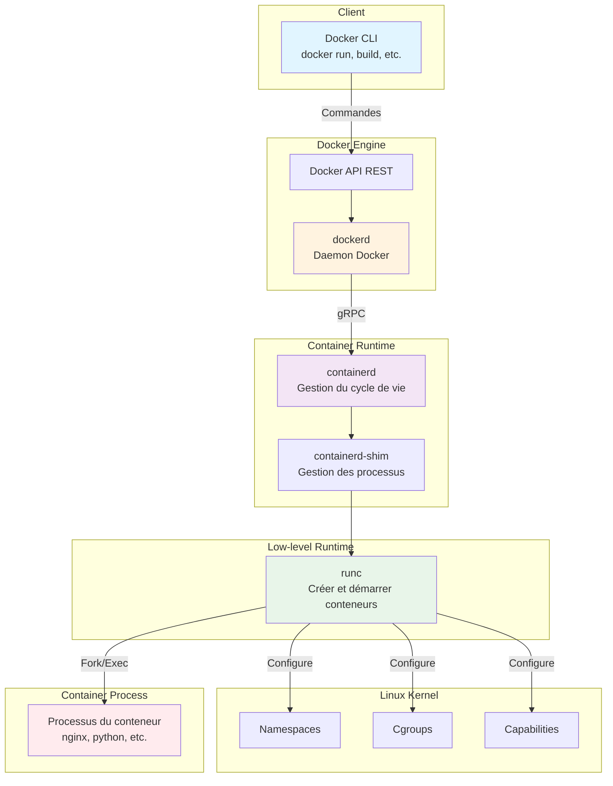
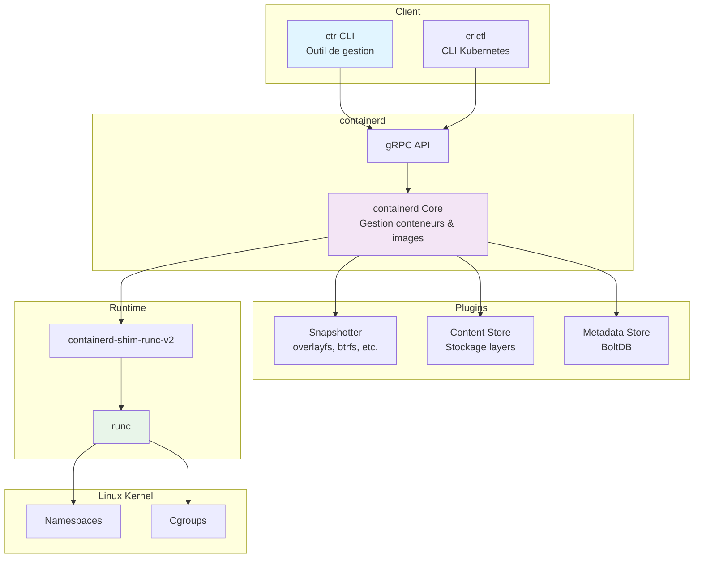
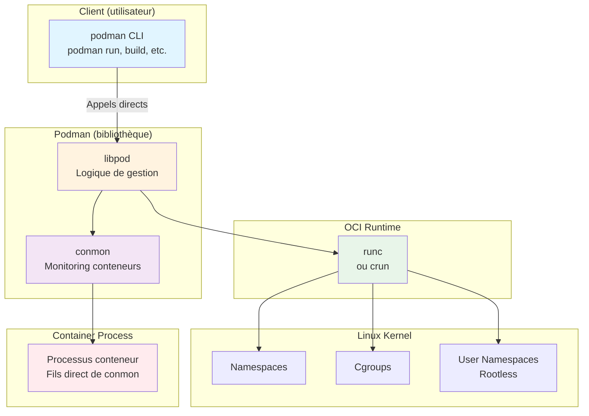

## Introduction

Les conteneurs Linux ne sont pas "magiques" - ils reposent sur des fonctionnalités du noyau Linux et une architecture logicielle en plusieurs couches. Dans ce cours, nous allons décortiquer :

1. **Les fondations Linux** : namespaces, cgroups, capabilities
2. **L'architecture Docker** : de Docker CLI à runc
3. **L'architecture containerd** : le runtime moderne
4. **L'architecture Podman** : l'approche sans daemon
5. **Comparaison et cas d'usage**

## Partie 1 : Les Fondations Linux des Conteneurs

Les conteneurs ne sont pas une technologie unique, mais une **combinaison de plusieurs fonctionnalités du noyau Linux**.

### 1.1 Les Namespaces : Isolation des Ressources

Les namespaces permettent d'isoler différentes vues des ressources système pour des processus.

**Concept** : Imaginez plusieurs personnes portant des lunettes de couleurs différentes dans la même pièce. Chacune voit une version colorée différente de la même réalité.

#### Types de Namespaces

| Namespace | Isolé | Description |
|-----------|-------|-------------|
| **PID** | Processus | Chaque conteneur a son propre arbre de processus (PID 1 indépendant) |
| **NET** | Réseau | Interfaces réseau, tables de routage, règles firewall séparées |
| **MNT** | Système de fichiers | Points de montage indépendants (le conteneur voit son propre /) |
| **UTS** | Hostname | Nom d'hôte et nom de domaine distincts |
| **IPC** | Communication inter-processus | Files de messages, sémaphores, mémoire partagée séparés |
| **USER** | Utilisateurs | Mappage des UID/GID (root dans le conteneur ≠ root sur l'hôte) |
| **CGROUP** | Limites de ressources | Vue isolée de la hiérarchie cgroup |
| **TIME** | Horloge système | Horloge virtuelle (depuis kernel 5.6) |

#### Démonstration : Namespace PID

```bash
# Sur l'hôte
ps aux | head -5

# Dans un conteneur
docker run --rm alpine ps aux

# Résultat : Le conteneur voit seulement SES processus
# avec PID 1 = processus principal du conteneur
```

**Explication** : Le namespace PID crée une nouvelle numérotation de processus. Le processus qui semble être PID 1 dans le conteneur a en réalité un autre PID sur le système hôte.

#### Démonstration : Namespace NET

```bash
# Interfaces réseau de l'hôte
ip addr show

# Interfaces réseau dans un conteneur
docker run --rm alpine ip addr show

# Le conteneur a son propre eth0, lo, etc.
```

### 1.2 Les Control Groups (cgroups) : Limitation des Ressources

Les **cgroups** limitent et mesurent l'utilisation des ressources par les processus.

#### Ressources Contrôlées

```
┌─────────────────────────────────────────┐
│         Control Groups (cgroups)        │
├─────────────────────────────────────────┤
│                                         │
│  CPU        ──→  % de CPU utilisable   │
│  Memory     ──→  RAM maximale          │
│  Block I/O  ──→  Débit disque max      │
│  Network    ──→  Bande passante        │
│  PIDs       ──→  Nombre de processus   │
│  Devices    ──→  Accès aux périphériques │
│                                         │
└─────────────────────────────────────────┘
```

#### Exemple Pratique

```bash
# Lancer un conteneur limité à 512 MB de RAM et 0.5 CPU
docker run -d --name limited \
  --memory="512m" \
  --cpus="0.5" \
  nginx:alpine

# Vérifier les limites appliquées
docker stats limited

# Voir les cgroups sur l'hôte
cat /sys/fs/cgroup/memory/docker/<container-id>/memory.limit_in_bytes
```

**Résultat** : Le conteneur ne pourra jamais dépasser 512 MB de RAM, même si l'hôte a 32 GB disponibles.

### 1.3 Les Capabilities : Granularité des Privilèges

Les **capabilities** divisent les privilèges root en unités plus fines.

Au lieu de : `root` (tous les pouvoirs) vs `utilisateur` (aucun pouvoir)

Linux propose ~40 capabilities individuelles :

```
┌──────────────────────────────────────────┐
│       Linux Capabilities (extrait)       │
├──────────────────────────────────────────┤
│ CAP_NET_BIND_SERVICE  → Bind port < 1024│
│ CAP_NET_ADMIN        → Config réseau    │
│ CAP_SYS_ADMIN        → Admin système    │
│ CAP_CHOWN            → Changer proprio  │
│ CAP_DAC_OVERRIDE     → Bypass perms     │
│ CAP_SETUID/SETGID    → Changer UID/GID  │
│ CAP_KILL             → Envoyer signaux  │
└──────────────────────────────────────────┘
```

#### Conteneur avec Capacités Limitées

```bash
# Conteneur par défaut : certaines capabilities retirées
docker run --rm alpine sh -c 'capsh --print | grep Current'

# Ajouter une capability (bind port 80 sans root)
docker run --rm --cap-add=NET_BIND_SERVICE alpine ...

# Retirer toutes les capabilities sauf CAP_NET_BIND_SERVICE
docker run --rm --cap-drop=ALL --cap-add=NET_BIND_SERVICE alpine ...
```

**Sécurité** : Un conteneur Docker standard n'a PAS tous les pouvoirs root, même si le processus tourne en tant que UID 0.

### 1.4 Union Filesystems : Système de Fichiers en Couches

Les conteneurs utilisent des **systèmes de fichiers en couches** (overlay, aufs, btrfs).

```
┌─────────────────────────────────────────┐
│     Conteneur (vue combinée)            │
│         READ-WRITE LAYER                │  ← Modifications du conteneur
├─────────────────────────────────────────┤
│     IMAGE LAYER 3 (app files)           │  ← READ-ONLY
│     IMAGE LAYER 2 (dependencies)        │  ← READ-ONLY
│     IMAGE LAYER 1 (base OS)             │  ← READ-ONLY
└─────────────────────────────────────────┘
```

**Avantages** :
- Partage des couches entre conteneurs (économie disque)
- Démarrage rapide (pas de copie complète)
- Isolation des modifications (layer R/W séparé)

#### Exemple

```bash
# Inspecter les layers d'une image
docker image inspect nginx:alpine | grep -A 20 "RootFS"

# Voir le driver de stockage utilisé
docker info | grep "Storage Driver"
```

### 1.5 Récapitulatif : Les Briques Linux

```
┌────────────────────────────────────────────────────────────┐
│                CONTENEUR LINUX                             │
├────────────────────────────────────────────────────────────┤
│                                                            │
│  Namespaces      →  Isolation (PID, NET, MNT, etc.)       │
│  Cgroups         →  Limitations (CPU, RAM, I/O)           │
│  Capabilities    →  Sécurité (privilèges granulaires)     │
│  Union FS        →  Layers en lecture seule + R/W         │
│  Seccomp         →  Filtrage syscalls                     │
│  AppArmor/SELinux→  Mandatory Access Control              │
│                                                            │
└────────────────────────────────────────────────────────────┘
```

**Important** : Un conteneur n'est PAS une VM. C'est un processus Linux normal avec des restrictions appliquées par le noyau.

## Partie 2 : Architecture Docker

Docker est une **architecture en couches** où chaque composant a un rôle précis.

### 2.1 Schéma d'Architecture Docker Complet



### 2.2 Description des Composants

#### Docker CLI (`docker`)

- **Rôle** : Interface utilisateur en ligne de commande
- **Communication** : Envoie des requêtes HTTP à l'API Docker
- **Socket** : Généralement `/var/run/docker.sock` (Unix socket)

```bash
# Exemple de communication
docker run nginx
  ↓
HTTP POST /v1.41/containers/create
  → dockerd
```

#### Docker Daemon (`dockerd`)

- **Rôle** : Cœur de Docker, gère les images, volumes, réseaux
- **Responsabilités** :
  - Build des images
  - Gestion du cache de layers
  - Gestion des volumes et réseaux
  - Orchestration de containerd
- **Mode** : Daemon privilégié (root)

#### containerd

- **Rôle** : Runtime de conteneurs de niveau intermédiaire
- **Responsabilités** :
  - Cycle de vie des conteneurs (start, stop, pause)
  - Gestion du stockage d'images
  - Gestion des snapshots
  - Exécution via runc
- **Communication** : gRPC avec dockerd
- **Indépendance** : Peut fonctionner sans Docker (utilisé par Kubernetes)

#### containerd-shim

- **Rôle** : Processus intermédiaire entre containerd et le conteneur
- **Responsabilités** :
  - Permet à containerd de se déconnecter après le démarrage
  - Capture les signaux (SIGTERM, etc.)
  - Redirige STDIN/STDOUT/STDERR
  - Rapporte le code de sortie

**Pourquoi ?** Si containerd crashe, les conteneurs continuent de tourner grâce au shim.

#### runc

- **Rôle** : Runtime OCI (Open Container Initiative) bas niveau
- **Responsabilités** :
  - Créer les namespaces
  - Configurer les cgroups
  - Appliquer les capabilities
  - Fork/exec le processus final
- **Standard** : Implémentation de référence OCI

```bash
# runc peut être utilisé directement
runc run mycontainer
```

### 2.3 Flux d'Exécution : `docker run nginx`

```
┌──────────────────────────────────────────────────────────────┐
│  $ docker run -d nginx:alpine                                │
└──────────────────────────────────────────────────────────────┘
                           │
                           ▼
┌──────────────────────────────────────────────────────────────┐
│  1. Docker CLI → API Docker (POST /containers/create)        │
└──────────────────────────────────────────────────────────────┘
                           │
                           ▼
┌──────────────────────────────────────────────────────────────┐
│  2. dockerd                                                   │
│     - Vérifie si l'image nginx:alpine existe localement      │
│     - Sinon, pull depuis Docker Hub                          │
│     - Crée les metadata du conteneur                         │
└──────────────────────────────────────────────────────────────┘
                           │
                           ▼
┌──────────────────────────────────────────────────────────────┐
│  3. dockerd → containerd (gRPC)                               │
│     - Demande de créer un conteneur                          │
│     - Passe la config (image, env, limites, etc.)            │
└──────────────────────────────────────────────────────────────┘
                           │
                           ▼
┌──────────────────────────────────────────────────────────────┐
│  4. containerd                                                │
│     - Prépare le rootfs (Union filesystem)                   │
│     - Lance containerd-shim                                  │
└──────────────────────────────────────────────────────────────┘
                           │
                           ▼
┌──────────────────────────────────────────────────────────────┐
│  5. containerd-shim → runc                                    │
│     - Passe la config OCI (JSON)                             │
│     - runc crée les namespaces, cgroups, capabilities        │
└──────────────────────────────────────────────────────────────┘
                           │
                           ▼
┌──────────────────────────────────────────────────────────────┐
│  6. runc fork/exec                                            │
│     - Le processus nginx démarre dans son namespace isolé    │
│     - runc se termine, shim reste actif                      │
└──────────────────────────────────────────────────────────────┘
                           │
                           ▼
┌──────────────────────────────────────────────────────────────┐
│  7. Conteneur actif                                           │
│     - Processus nginx tourne                                 │
│     - containerd-shim surveille                              │
│     - dockerd reçoit les logs, stats, etc.                   │
└──────────────────────────────────────────────────────────────┘
```

### 2.4 Vérification sur le Système

```bash
# Voir les processus Docker
sudo ps aux | grep docker

# Exemple de sortie :
# root  1234  dockerd --host=unix:///var/run/docker.sock
# root  1235  containerd --config /var/run/docker/containerd/containerd.toml
# root  5678  containerd-shim -namespace moby -id abc123...
# root  5679    \_ nginx: master process

# Arbre des processus
pstree -p | grep dockerd

# Vérifier containerd
sudo ctr --namespace moby containers list
```

## Partie 3 : Architecture containerd (Standalone)

containerd peut être utilisé **indépendamment de Docker**, notamment dans Kubernetes.

### 3.1 Schéma containerd Standalone



### 3.2 containerd dans Kubernetes

Kubernetes utilise containerd via **CRI (Container Runtime Interface)**.

```
┌─────────────────────────────────────────────┐
│            Kubernetes Node                  │
├─────────────────────────────────────────────┤
│                                             │
│  kubelet  ──CRI─→  containerd              │
│                         │                   │
│                         ▼                   │
│                    containerd-shim          │
│                         │                   │
│                         ▼                   │
│                       runc                  │
│                         │                   │
│                         ▼                   │
│                   Pod Containers            │
│                                             │
└─────────────────────────────────────────────┘
```

**Avantage** : Plus léger que Docker (pas besoin de dockerd et de toute sa logique de build/réseau/volumes).

### 3.3 Commandes containerd

```bash
# Lister les conteneurs (namespace moby = Docker)
sudo ctr --namespace moby containers list

# Lister les images
sudo ctr --namespace moby images list

# Lancer un conteneur (bas niveau, pas recommandé pour usage quotidien)
sudo ctr run docker.io/library/nginx:alpine my-nginx

# Inspecter
sudo ctr --namespace moby containers info <container-id>
```

## Partie 4 : Architecture Podman

Podman adopte une approche **radicalement différente** : **pas de daemon central**.

### 4.1 Schéma Architecture Podman



### 4.2 Différences Clés avec Docker

| Aspect | Docker | Podman |
|--------|--------|--------|
| **Daemon** | ✅ dockerd (root) | ❌ Pas de daemon |
| **Architecture** | Client-Serveur | Fork direct |
| **Privilèges** | Daemon root obligatoire | Rootless possible |
| **Processus parent** | containerd-shim | conmon |
| **API** | REST API | Pas d'API par défaut* |
| **Isolation** | Daemon = SPOF | Chaque commande isolée |
| **Compatibilité** | Docker CLI | Compatible Docker CLI |

_*Podman peut exposer une API compatible Docker via `podman system service`_

### 4.3 Flux d'Exécution Podman : `podman run nginx`

```
┌──────────────────────────────────────────────────────────────┐
│  $ podman run -d nginx:alpine                                │
└──────────────────────────────────────────────────────────────┘
                           │
                           ▼
┌──────────────────────────────────────────────────────────────┐
│  1. podman CLI (pas d'API REST)                               │
│     - Exécution directe en tant que processus utilisateur    │
│     - Pas de daemon intermédiaire                            │
└──────────────────────────────────────────────────────────────┘
                           │
                           ▼
┌──────────────────────────────────────────────────────────────┐
│  2. libpod (bibliothèque Go intégrée)                         │
│     - Gestion des images (storage local)                     │
│     - Création des metadata                                  │
│     - Préparation du rootfs                                  │
└──────────────────────────────────────────────────────────────┘
                           │
                           ▼
┌──────────────────────────────────────────────────────────────┐
│  3. conmon (Container Monitor)                                │
│     - Lance runc/crun                                        │
│     - Monitore le processus conteneur                        │
│     - Gère STDIN/STDOUT/STDERR                               │
└──────────────────────────────────────────────────────────────┘
                           │
                           ▼
┌──────────────────────────────────────────────────────────────┐
│  4. runc/crun                                                 │
│     - Configure namespaces (dont USER namespace si rootless) │
│     - Configure cgroups v2                                   │
│     - Fork/exec le processus nginx                           │
└──────────────────────────────────────────────────────────────┘
                           │
                           ▼
┌──────────────────────────────────────────────────────────────┐
│  5. Conteneur actif                                           │
│     - Processus nginx tourne                                 │
│     - conmon reste actif pour monitoring                     │
│     - Pas de daemon Docker/containerd                        │
└──────────────────────────────────────────────────────────────┘
```

### 4.4 Podman Rootless : La Révolution

Podman peut fonctionner **entièrement sans privilèges root** grâce aux **User Namespaces**.

```
┌─────────────────────────────────────────────────────┐
│         Système Hôte (point de vue noyau)           │
├─────────────────────────────────────────────────────┤
│  UID 1000 (utilisateur alice)                       │
│    │                                                │
│    └─→ Lance podman run nginx                      │
│                │                                    │
│                ▼                                    │
│         User Namespace créé                         │
│                │                                    │
│         Mapping UID :                               │
│         Container UID 0 (root) ──→ Host UID 1000   │
│         Container UID 1        ──→ Host UID 1001   │
│         ...                                         │
│                │                                    │
│                ▼                                    │
│         Processus nginx                             │
│         - Pense être root (UID 0)                  │
│         - Mais en réalité UID 1000 sur l'hôte      │
│         - Aucun pouvoir réel sur le système        │
│                                                     │
└─────────────────────────────────────────────────────┘
```

**Sécurité** : Un processus root dans un conteneur rootless n'a AUCUN pouvoir sur le système hôte.

```bash
# Lancer Podman en rootless (utilisateur normal)
podman run -d nginx:alpine

# Vérifier que c'est bien sans root
ps aux | grep nginx
# alice  12345  ... nginx: master process

# Le processus appartient à l'utilisateur, pas à root !
```

### 4.5 conmon : Le Remplaçant de containerd-shim

**conmon** (Container Monitor) joue le même rôle que containerd-shim dans Docker :

- Surveille le processus conteneur
- Capture les flux I/O
- Rapporte le code de sortie
- Permet à Podman de se terminer après le démarrage

```bash
# Voir conmon en action
ps aux | grep conmon

# Exemple :
# alice  12340  /usr/bin/conmon --api-version 1 -c abc123... -r /usr/bin/runc
# alice  12345    \_ nginx: master process
```

## Partie 5 : Comparaison et Cas d'Usage

### 5.1 Tableau Comparatif Complet

| Critère | Docker | containerd | Podman |
|---------|--------|------------|--------|
| **Daemon** | dockerd (obligatoire) | containerd (optionnel) | Aucun |
| **Privilèges** | Root requis | Root requis | Rootless natif |
| **Complexité** | 3+ composants | 2 composants | 2 composants |
| **API** | REST API riche | gRPC | Optionnel (compatible Docker) |
| **CLI** | `docker` | `ctr`, `crictl` | `podman` |
| **Build** | Intégré | Via plugins | Buildah (séparé) |
| **Registry** | Push/pull intégré | Push/pull intégré | Skopeo (séparé) |
| **Kubernetes** | Déprécié | Supporté (CRI) | Supporté (CRI-O) |
| **Docker Compose** | Natif | Non | podman-compose |
| **Pods** | Non | Non | Oui (style Kubernetes) |
| **Swarm** | Oui | Non | Non |
| **Sécurité** | Daemon root = risque | Daemon root | Pas de daemon root |
| **Performance** | Overhead daemon | Léger | Très léger |

### 5.2 Architecture Visuelle Comparative

```
┌────────────────────────────────────────────────────────────────────┐
│                         DOCKER                                     │
├────────────────────────────────────────────────────────────────────┤
│  docker CLI → dockerd (daemon) → containerd → shim → runc         │
│                                                                    │
│  Avantages :                                                       │
│  ✓ Écosystème riche (Desktop, Hub, Compose)                       │
│  ✓ Outils de build puissants                                      │
│  ✓ Documentation exhaustive                                       │
│                                                                    │
│  Inconvénients :                                                   │
│  ✗ Daemon root obligatoire (surface d'attaque)                    │
│  ✗ Architecture complexe (3+ composants)                          │
│  ✗ SPOF (Single Point of Failure)                                 │
└────────────────────────────────────────────────────────────────────┘

┌────────────────────────────────────────────────────────────────────┐
│                      CONTAINERD                                    │
├────────────────────────────────────────────────────────────────────┤
│  ctr/crictl → containerd → shim → runc                            │
│                                                                    │
│  Avantages :                                                       │
│  ✓ Léger et focalisé (pas de build, réseau complexe, etc.)       │
│  ✓ Standard Kubernetes                                            │
│  ✓ Stable et mature                                               │
│                                                                    │
│  Inconvénients :                                                   │
│  ✗ CLI basique (pas pour usage quotidien)                        │
│  ✗ Daemon root                                                     │
│  ✗ Pas d'outils de build                                          │
└────────────────────────────────────────────────────────────────────┘

┌────────────────────────────────────────────────────────────────────┐
│                        PODMAN                                      │
├────────────────────────────────────────────────────────────────────┤
│  podman CLI → libpod → conmon → runc/crun                        │
│                                                                    │
│  Avantages :                                                       │
│  ✓ Rootless par défaut (sécurité maximale)                       │
│  ✓ Pas de daemon (pas de SPOF)                                    │
│  ✓ Compatible Docker CLI (alias docker=podman)                    │
│  ✓ Support des pods Kubernetes                                    │
│                                                                    │
│  Inconvénients :                                                   │
│  ✗ Écosystème moins mature                                        │
│  ✗ Pas de Docker Swarm                                            │
│  ✗ Outils séparés (Buildah, Skopeo)                              │
└────────────────────────────────────────────────────────────────────┘
```

### 5.3 Quand Utiliser Quoi ?

#### Utiliser Docker si :
- Vous développez sur Windows/macOS (Docker Desktop)
- Vous avez besoin de Docker Swarm
- Vous voulez une solution "tout-en-un" simple
- Vous travaillez sur des projets avec docker-compose existants

#### Utiliser containerd si :
- Vous déployez sur Kubernetes
- Vous voulez un runtime léger sans fonctionnalités superflues
- Vous gérez un cluster (économie de ressources)

#### Utiliser Podman si :
- La sécurité est critique (rootless)
- Vous travaillez dans un environnement sans accès root
- Vous voulez éviter un daemon centralisé
- Vous préparez des déploiements Kubernetes (pods)
- Vous êtes sur Linux uniquement

### 5.4 OCI : Le Standard Commun

Tous ces outils respectent **OCI (Open Container Initiative)** :

```
┌─────────────────────────────────────────────────────┐
│           OCI (Open Container Initiative)           │
├─────────────────────────────────────────────────────┤
│                                                     │
│  Runtime Spec    →  Format de config conteneur     │
│  Image Spec      →  Format d'image                 │
│  Distribution    →  Format de distribution         │
│                                                     │
└─────────────────────────────────────────────────────┘
              │
    ┌─────────┼─────────┐
    │         │         │
    ▼         ▼         ▼
  Docker  containerd  Podman
    │         │         │
    └────────┬┴─────────┘
             │
             ▼
           runc / crun
           (OCI Runtime)
```

**Interopérabilité** : Une image construite avec Docker fonctionne dans Podman et vice-versa.

## Partie 6 : Exercices Pratiques

### Exercice 1 : Explorer les Namespaces

```bash
# 1. Lancer un conteneur
docker run -d --name test-ns nginx:alpine

# 2. Trouver le PID du processus principal
docker inspect test-ns | grep -i pid

# 3. Voir les namespaces du processus
sudo ls -l /proc/<PID>/ns

# Résultat attendu :
# lrwxrwxrwx 1 root root 0 ... mnt -> mnt:[4026532xxx]
# lrwxrwxrwx 1 root root 0 ... net -> net:[4026532xxx]
# ...

# 4. Comparer avec les namespaces de l'hôte
sudo ls -l /proc/1/ns

# Les numéros sont différents = namespaces isolés !
```

### Exercice 2 : Limites Cgroups

```bash
# 1. Lancer un conteneur avec stress-test limité
docker run -d --name stress \
  --memory="100m" \
  --cpus="0.5" \
  progrium/stress \
  --vm 1 --vm-bytes 150M

# 2. Observer les stats
docker stats stress

# Le conteneur essaie d'allouer 150M mais limité à 100M
# → OOM (Out Of Memory) kill probable

# 3. Voir les cgroups sur le système
cat /sys/fs/cgroup/memory/docker/<container-id>/memory.limit_in_bytes
```

### Exercice 3 : Comparer Docker et Podman

```bash
# Avec Docker
docker run -d --name nginx-docker nginx:alpine
ps aux | grep nginx
# → Processus appartient à root

# Avec Podman (rootless)
podman run -d --name nginx-podman nginx:alpine
ps aux | grep nginx
# → Processus appartient à votre utilisateur !

# Vérifier les processus parents
pstree -p | grep nginx-docker  # → containerd-shim
pstree -p | grep nginx-podman  # → conmon
```

### Exercice 4 : Capabilities

```bash
# Lancer un conteneur et voir les capabilities
docker run --rm alpine sh -c 'apk add -q libcap && capsh --print'

# Retirer toutes les capabilities
docker run --rm --cap-drop=ALL alpine sh -c 'apk add -q libcap && capsh --print'

# Essayer de changer le hostname (nécessite CAP_SYS_ADMIN)
docker run --rm alpine hostname new-hostname
# → fonctionne (Docker garde certaines caps)

docker run --rm --cap-drop=ALL alpine hostname new-hostname
# → échoue (plus de capabilities)
```

## Conclusion

### Points Clés à Retenir

1. **Les conteneurs sont des processus Linux** avec isolation via namespaces, cgroups et capabilities
2. **Docker** = Architecture complète avec daemon, build, réseau, orchestration
3. **containerd** = Runtime focalisé, standard Kubernetes
4. **Podman** = Alternative sans daemon, rootless, sécurisée
5. **OCI** = Standard garantissant l'interopérabilité

### Aller Plus Loin

- **Seccomp profiles** : Filtrer les syscalls autorisés
- **AppArmor/SELinux** : Mandatory Access Control
- **Cgroups v2** : Nouvelle architecture de cgroups
- **crun** : Runtime OCI alternatif à runc (en C, plus rapide)

### Ressources

- [OCI Specifications](https://opencontainers.org/)
- [runc GitHub](https://github.com/opencontainers/runc)
- [containerd](https://containerd.io/)
- [Podman](https://podman.io/)
- [Linux Namespaces (man7.org)](https://man7.org/linux/man-pages/man7/namespaces.7.html)
